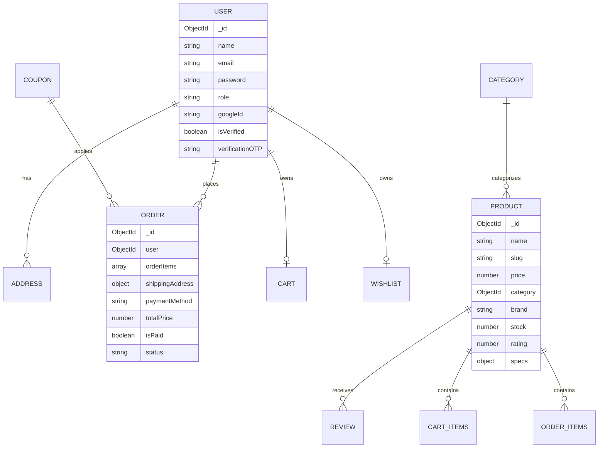

# CHRONOVA &mdash; Premium Luxury Watch E-Commerce

Chronova is a production-ready, high-end full-stack luxury watch e-commerce showroom. It is built with an "Apple-level" clean, minimal dark aesthetic to capture the feel of a luxury watch boutique. 

---

## 💎 Brand & Logo Concept

- **Brand Name**: Chronova (combines *Chronos* representing time, and *Nova* representing modern/new).
- **Design Theme**: Deep obsidian black (`#0d0d0d`), warm gold (`#d4af37`), chrome silver text, and warm gray dividers.
- **Logo Concept**:
  ```text
     ______  __    __  ______   ______   __   __  ______   __   __  ______5
    /\  ___\/\ \  /\ \/\  == \ /\  __ \ /\ "-.\ \/\  __ \ /\ \ / / /\  __ \
    \ \ \___\ \ \_\ \ \ \  __< \ \ \/\ \\ \ \-.  \ \ \/\ \\ \ \'/  \ \  __ \
     \ \_____\ \_____\ \_\ \_\_\ \_____\\ \_\\"\_\ \_____\\ \__|   \ \_\ \_\
      \/_____/\/_____/\/_/ /_/ /_/\/_____/ \/_/ \/_/\/_____/ \/_/     \/_/\/_/
  
                      [ ʘ ] -- LUXURY HOROLOGY -- [ ʘ ]
  ```
  *Visual concept*: A minimalist watch crown emblem enclosing a clean clock hands shape, gilded in primary gold against dark marble layouts.

---

## 📁 Folder Structure

```text
chronova/
├── backend/
│   ├── src/
│   │   ├── config/          # Database, Passport OAuth, and Cloudinary settings
│   │   ├── controllers/     # MVC Controllers (auth, products, orders, payments, admin)
│   │   ├── middlewares/     # Protect routes, errors, rate limits, validation middlewares
│   │   ├── models/          # Mongoose DB Schemas
│   │   ├── routes/          # Express API route declarations
│   │   ├── scripts/         # Database seeding script
│   │   ├── utils/           # Nodemailer, PDFKit invoice generation, Zod schemas
│   │   └── server.ts        # App bootstrapper
│   ├── Dockerfile
│   ├── package.json
│   └── tsconfig.json
├── frontend/
│   ├── src/
│   │   ├── app/             # Next.js App Router (pages: home, detail, listing, checkout)
│   │   ├── components/      # UI templates (Navbar, Footer, ProductCards, Testimonials)
│   │   ├── store/           # Zustand global state (Auth, Cart, Wishlist, UI elements)
│   │   ├── types/           # Global TypeScript type definitions
│   │   └── utils/           # API fetch wrapper
│   ├── Dockerfile
│   ├── package.json
│   └── tailwind.config.ts
├── .github/
│   └── workflows/
│       └── deploy.yml       # CI/CD validation actions
├── docker-compose.yml       # Local orchestration composition
└── README.md
```

---

## 🗄️ Database Architecture

We use MongoDB Atlas managed via Mongoose. The collections and references map as follows:



---

## 🔑 Test Accounts & Sandboxes

When the database seed is executed, the following login credentials are created:

### 👤 Test Administrator
- **Email**: `admin@chronova.com`
- **Password**: `Admin@Chronova2026`
- **Role**: `admin` (Full dashboard access: CRUDS, inventory alerts, orders status updating)

### 👤 Test Customer
- **Email**: `customer@chronova.com`
- **Password**: `Customer@Chronova2026`
- **Role**: `user` (Pre-seeded address, active order logs, and review permissions)

### 🎟️ Active Promos
- `WELCOME10`: 10% discount on order subtotals over $200 (max discount $50).
- `CHRONOVA20`: 20% discount on order subtotals over $1000 (max discount $300).

---

## 🔌 API Route Specifications

| Resource | Method | Route | Protection | Description |
| :--- | :--- | :--- | :--- | :--- |
| **Auth** | POST | `/api/auth/register` | Public | Register account (sends 6-digit verification OTP) |
| | POST | `/api/auth/verify-otp` | Public | Confirm verification OTP, issue JWT cookie |
| | POST | `/api/auth/login` | Public | Credentials login (re-sends OTP if unverified) |
| | GET | `/api/auth/profile` | Logged In | Return details of logged-in user |
| | POST | `/api/auth/address` | Logged In | Add address to profile |
| **Products**| GET | `/api/products` | Public | List products (paginated, with search + filters) |
| | GET | `/api/products/slug/:slug` | Public | Fetch single timepiece details and reviews |
| | POST | `/api/products` | Admin | Create new timepiece |
| | PUT | `/api/products/:id` | Admin | Update timepiece particulars |
| **Orders** | POST | `/api/orders` | Logged In | Verify cart rates, decrement stock, create Order |
| | GET | `/api/orders/my` | Logged In | List logged-in user order history |
| | GET | `/api/orders/:id/invoice`| Logged In | Returns dynamically generated PDF Invoice stream |
| **Payments**| POST | `/api/payments/stripe/session` | Logged In | Generate Stripe checkout redirect session |
| | POST | `/api/payments/stripe/webhook` | Raw Webhook | Stripe server event listener (updates orders to PAID) |
| | POST | `/api/payments/razorpay/order` | Logged In | Initialize Razorpay Order payload |
| | POST | `/api/payments/razorpay/verify`| Logged In | Verify HMAC SHA256 payment signature |
| **Admin** | GET | `/api/admin/stats` | Admin | Return sales charts, low stock alerts, counts |

---

## 🚀 Local Installation Guide

### Prerequisites
- Node.js (v20+)
- MongoDB running locally on `mongodb://localhost:27017`

### 1. Configure Environments
Create a `.env` file in the `backend/` folder based on `backend/.env.example`:
```bash
# In backend/.env
MONGO_URI=mongodb://localhost:27017/chronova
JWT_SECRET=chronova_super_secret_jwt_key_2026_luxury_watches
FRONTEND_URL=http://localhost:3000
PORT=5000
```

### 2. Install and Seed Database
Run the following inside your terminal to install packages and populate initial watch data:
```bash
# In backend/ directory
npm install
npm run seed
```

### 3. Run Dev Servers
Start the Node API server and the Next.js development server:
```bash
# Terminal 1: Run Express Server (Port 5000)
cd backend
npm run dev

# Terminal 2: Run Next.js App (Port 3000)
cd ../frontend
npm run dev
```

Open [http://localhost:3000](http://localhost:3000) in your browser.

---

## 🐳 Docker Deployment

To spin up the entire application locally using Docker:
```bash
# In the root chronova/ folder containing docker-compose.yml
docker-compose up --build
```
This boots up:
- MongoDB on `localhost:27017`
- Express API on `localhost:5000`
- Next.js Web Client on `localhost:3000`

---

## ☁️ Production Deployment Instructions

### 1. Frontend: Next.js on Vercel
- Link your GitHub repository to Vercel.
- Select the `frontend/` folder as the Root Directory.
- Set Framework Preset to **Next.js**.
- Define Environment Variables:
  - `NEXT_PUBLIC_API_URL`: Direct link to your deployed backend (e.g. `https://api.chronova.com/api`).
- Click **Deploy**.

### 2. Backend: Node/Express on Render or Railway
- Deploy the `backend/` directory from your repository.
- Ensure the Build Command is `npm run build` and Start Command is `npm start`.
- Configure Environment variables:
  - `MONGO_URI`: MongoDB Atlas connection string.
  - `JWT_SECRET`: Random secure string.
  - `FRONTEND_URL`: URL of your Vercel deployment (e.g. `https://chronova.vercel.app`).
  - `SMTP_USER` & `SMTP_PASS`: SMTP mail credentials.
  - `STRIPE_SECRET_KEY` & `STRIPE_WEBHOOK_SECRET`: Live keys from Stripe Dashboard.
  - `RAZORPAY_KEY_ID` & `RAZORPAY_KEY_SECRET`: Live keys from Razorpay Dashboard.
